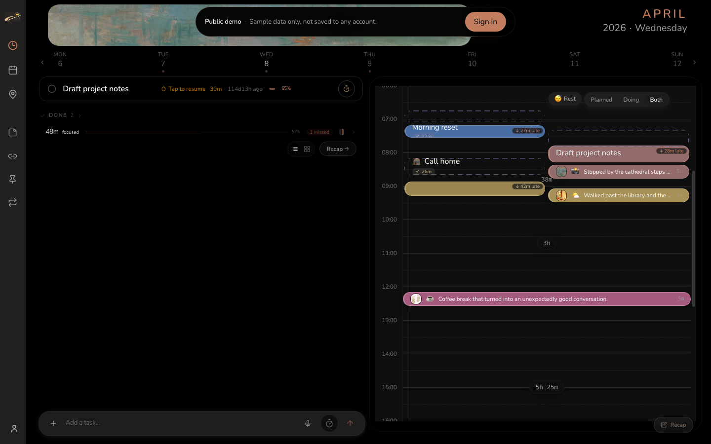
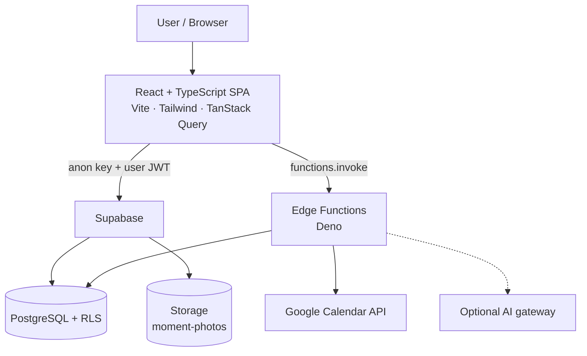

# Evidence of Life

> **See where your time went. Remember where life happened.**

Evidence of Life is an ADHD-friendly visual planning and life-memory system that combines task lists with a draggable daily timeline, planned-versus-actual tracking, and map-based moments. Instead of keeping plans, activities, photos, and places in separate tools, it connects them into one private record of lived time.

**[Live demo](https://evidenceoflife-v2.vercel.app/demo-app)** · **[Self-hosting](docs/oss/self-hosting.md)** · **[Security model](docs/SECURITY_MODEL.md)** · **[Contributing](CONTRIBUTING.md)** · **[Agents](AGENTS.md)**

[](LICENSE)
[](https://vitejs.dev/)
[](https://react.dev/)
[](https://www.typescriptlang.org/)
[](https://tailwindcss.com/)
[](https://supabase.com/)
[](https://github.com/Cyriellewu/evidenceoflife-v2/actions/workflows/ci.yml)

> Designed around challenges commonly experienced by people with ADHD and time-blindness. It is **not** a diagnostic, clinical, or treatment tool.

## For AI coding agents

Machine-readable and agent-policy entrypoints (no product behavior change):

| File | Purpose |
| --- | --- |
| [`llms.txt`](llms.txt) | Compact project map |
| [`llms-full.txt`](llms-full.txt) | Expanded module / security index |
| [`AGENTS.md`](AGENTS.md) | Shared agent policy + verification gates |
| [`.codex/instructions.md`](.codex/instructions.md) | Codex-oriented instructions |
| [`.cursor/rules/evidenceoflife.mdc`](.cursor/rules/evidenceoflife.mdc) | Cursor always-on rules |
| [`.cursorrules`](.cursorrules) | Legacy Cursor entrypoint |

Agents should verify TypeScript with `npm run typecheck` (SWC does not type-check) and avoid inventing features or claiming unrun tests.

## Screenshots

<p align="center">
  
</p>

Additional captures (map, calendar, habits) can be added under [`docs/screenshots/`](docs/screenshots/). See that folder for naming guidelines. Prefer the synthetic `/demo-app` so no real personal data is published.

## Overview

**Problem.** Most productivity apps remember what you *planned*. Journals wait for you to rewrite what *happened*. Between calendars, timers, photos, and chat history, ordinary days become hard to reconstruct.

**What this project does.** Evidence of Life connects planning and memory in one private SPA: you plan the day on a timeline, run focus sessions, attach moments (notes, photos, places, tags), track longer-term dues and habits, and browse history by time and map.

**Who it is for.** Individuals who want a self-hosted or privately hosted personal system — especially people who think in planned-vs-actual time and want an archive they own. Positioning is **design goals for ADHD-friendly execution**, not medical treatment.
## Why it's different

Most productivity tools record what you *intend* to do. Journals record memories
*after* they happen. Evidence of Life connects both.

- **Lists show what** — capture tasks, habits, deadlines, and intentions without forcing everything into today's schedule.
- **Timelines reveal when** — drag tasks into visible time blocks, see whether the day is realistic, and rearrange plans as life changes.
- **Actual records show where time went** — compare intended activity with focus sessions, completed work, delays, interruptions, and unexpected moments.
- **Maps preserve where life happened** — attach photos and moments to locations, leaving a personal trace across neighborhoods, cities, and the globe.

## ADHD-friendly by design

| Challenge | Product response |
| --- | --- |
| Time feels abstract | A visible daily timeline externalizes time. |
| Long lists feel overwhelming | Tasks can be placed into concrete time windows. |
| Plans change frequently | Drag-and-drop rescheduling avoids rebuilding the day. |
| Small time windows are hard to use | Visible gaps make short tasks easier to identify and start. |
| The day is hard to remember later | Calendar events, focus sessions, photos, and places preserve context. |
| Deviation feels like failure | Planned and actual activity are both retained without judgment. |
| Memories feel disconnected | Moments are organized through both time and place. |

See [docs/PRODUCT_PHILOSOPHY.md](docs/PRODUCT_PHILOSOPHY.md) for the full model.

## Early validation

Evidence of Life has been tested by approximately **30–40 early users** and has
evolved through direct, informal feedback — especially around visual timeline
planning, drag-and-drop scheduling, lower-friction capture, reminders, understanding
where time goes, and map-based memory. Earlier feedback was not consistently archived
as public issues, so these themes are presented as a qualitative summary rather than
formal metrics. See [docs/USER_FEEDBACK.md](docs/USER_FEEDBACK.md).

## Features

Implemented in the current codebase (nothing invented):

- **Today / Plan dashboard** — day timeline, task planning, focus timers, planned-vs-actual views
- **Recap** — review what you actually did; optional AI “life replay” narrative when configured
- **Moments** — free-form capture with photos, locations, tags, mood, and links
- **Dues & habits** — deadlines, multi-step goals, recurring habits and streaks
- **Sticky notes** — lightweight personal checklists
- **Link hub** — saved links with server-side preview metadata
- **Map** — visited places with category hints (restaurant, coffee, park, museum…)
- **Calendar & year views** — browse history by day, month, and year-at-a-glance
- **Google Calendar sync** — OAuth import of external events into the timeline
- **Authentication** — Supabase Auth (email and/or providers you configure)
- **Reminders** — in-app / browser notification reminders; optional [ntfy](https://ntfy.sh/) push for life-capture nudges (Profile → Life Capture Reminder); due reminders in the product UI
- **Smart input** — optional AI-assisted classification of free text / voice into moments, plans, or dues
- **Public synthetic demo** — `/demo-app` runs without a real backend for UI exploration
- **Evidence export** — JSON export helpers for user-owned data

## Tech Stack

### Frontend

- React 18 + TypeScript
- Vite 5
- Tailwind CSS + shadcn/ui (Radix primitives)
- React Router, TanStack Query
- Recharts, Leaflet (map), date-fns

### Backend

- Supabase Auth, Postgres, Storage
- Supabase Edge Functions (Deno): `geo`, `smart-input`, `link-preview`, `image-proxy`, `life-replay`, `google-calendar-*`
- Row Level Security on personal tables; private photo bucket with signed URLs

### Integrations

- **Google Calendar API** — OAuth connect + sync (HMAC-signed OAuth `state`, redirect allowlist)
- **Optional AI gateway** — `LOVABLE_API_KEY` for smart-input / life-replay (omit to disable; env name is historical)
- **Optional ntfy** — client publishes life reminders to a user-chosen topic (ntfy.sh or self-hosted); no server secret required
- **Optional analytics** — Amplitude / GA4 public measurement IDs via `VITE_*` (client-side only)

## Architecture



Static hosting (e.g. Vercel) serves the SPA. Auth, data, and most server logic live in the operator’s Supabase project.

## Development Workflow

This repository was built as a spare-time, single-maintainer project with substantial help from AI coding assistants (including Cursor / Codex-class tools) for:

- implementing and iterating product features in React + TypeScript
- debugging type errors, tests, and CI failures
- refactoring hooks and view components without changing product intent
- drafting security hardening (edge auth helpers, OAuth state signing) and OSS docs
- accelerating PR-sized batches of documentation and quality-gate work

Human review remains the gate for merges, security-sensitive paths, and release decisions. AI did not replace ownership of architecture or privacy trade-offs.

## Local Development

### Requirements

- Node.js **20+** (see `.nvmrc`; 18+ may work)
- npm
- Optional: [Supabase CLI](https://supabase.com/docs/guides/cli) for migrations and function deploy
- Optional: Deno (for `npm run test:security`)

### Install & run (UI)

```sh
npm install
cp .env.example .env
# fill VITE_SUPABASE_URL + VITE_SUPABASE_PUBLISHABLE_KEY for full data features
npm run dev
```

Open [http://localhost:8080](http://localhost:8080).

**Backend-free UI:** [http://localhost:8080/demo-app](http://localhost:8080/demo-app) uses synthetic sample data.

### Environment variables

Client (Vite) — see [`.env.example`](.env.example):

| Variable | Required for | Notes |
| --- | --- | --- |
| `VITE_SUPABASE_URL` | real auth/data | Project URL |
| `VITE_SUPABASE_PUBLISHABLE_KEY` | real auth/data | Anon / publishable key only |
| `VITE_SUPABASE_PROJECT_ID` | convenience | Project ref |
| `VITE_AMPLITUDE_API_KEY` / `VITE_GA_MEASUREMENT_ID` | optional | Public analytics IDs |

Edge secrets (via `supabase secrets set`, never in the browser): `SUPABASE_SERVICE_ROLE_KEY`, `APP_URL`, `ALLOWED_REDIRECT_ORIGINS`, `OAUTH_STATE_SECRET`, `GOOGLE_CLIENT_ID`, `GOOGLE_CLIENT_SECRET`, optional `LOVABLE_API_KEY`.

Full migration + Auth + function deploy steps: [docs/oss/self-hosting.md](docs/oss/self-hosting.md).

### Quality commands

```sh
npm run typecheck
npm test
npm run lint
npm run test:e2e          # Playwright demo smoke
npm run test:security     # Deno edge auth unit tests (needs Deno)
npm run build
```

## Project Structure

```
src/
  components/     UI + feature views (Today, Plan, Map, Calendar, Dues…)
  hooks/          Data hooks (moments, todos, dues, places, auth…)
  integrations/   Supabase client + generated types
  lib/            Pure helpers (scheduling, photos, export…)
  pages/          Routes (Landing, Auth, App, PublicDemo)
supabase/
  functions/      Deno edge functions
  migrations/     SQL migrations (RLS, storage, schema)
docs/
  oss/            Self-hosting, roadmap, release drafts
  screenshots/    README visuals
  SECURITY_MODEL.md
e2e/              Playwright smoke tests
```

## Future Improvements

Realistic, non-binding direction (also tracked in [docs/oss/roadmap.md](docs/oss/roadmap.md)):

- Live-DB RLS verification and complete account deletion coverage
- Stronger regression tests around timers, timezone rollover, and calendar sync
- Contributor onboarding: curated good-first issues and third-party self-host verification
- First tagged release with finalized notes (drafts live under `docs/oss/`)

**Non-goals:** medical/therapeutic claims; fake adoption metrics; growth-hacking the public repo.

## Contributing & community

- [CONTRIBUTING.md](CONTRIBUTING.md) — local setup and PR gates
- [docs/PRODUCT_PHILOSOPHY.md](docs/PRODUCT_PHILOSOPHY.md) — the list → timeline → actual → map → recap model
- [docs/USER_FEEDBACK.md](docs/USER_FEEDBACK.md) — how real usage shaped the product
- [CODE_OF_CONDUCT.md](CODE_OF_CONDUCT.md)
- [SECURITY.md](SECURITY.md)
- [PRIVACY.md](PRIVACY.md)
- [LICENSE](LICENSE) — MIT

## Deployment

The app is a static SPA (`vercel.json` rewrites to `index.html`). Build with `npm run build` and host `dist/`. Deploy Supabase edge functions separately with the Supabase CLI.
